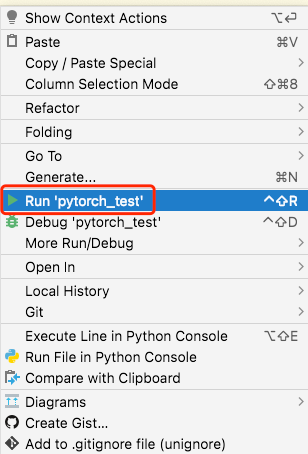
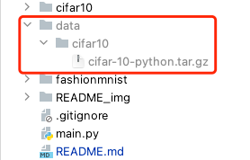

# 5511 Final Project

## Steps

###1.Download the pytorch environment in your local path
> Choose the appropriate command according to your computer operating system. (https://pytorch.org/get-started/locally/)

**Mac**
> conda install pytorch torchvision torchaudio -c pytorch

**Windows**
> conda install pytorch torchvision torchaudio cpuonly -c pytorch

###2.Download the tensorflow environment in your local path
> Choose the appropriate command according to your computer operating system. (https://www.tensorflow.org/install/pip/)

###3. Get dataset

> Run local pytorch.py files to download dataset

> After running py files, the data set will appear in the <kbd>./data</kbd> directory.

